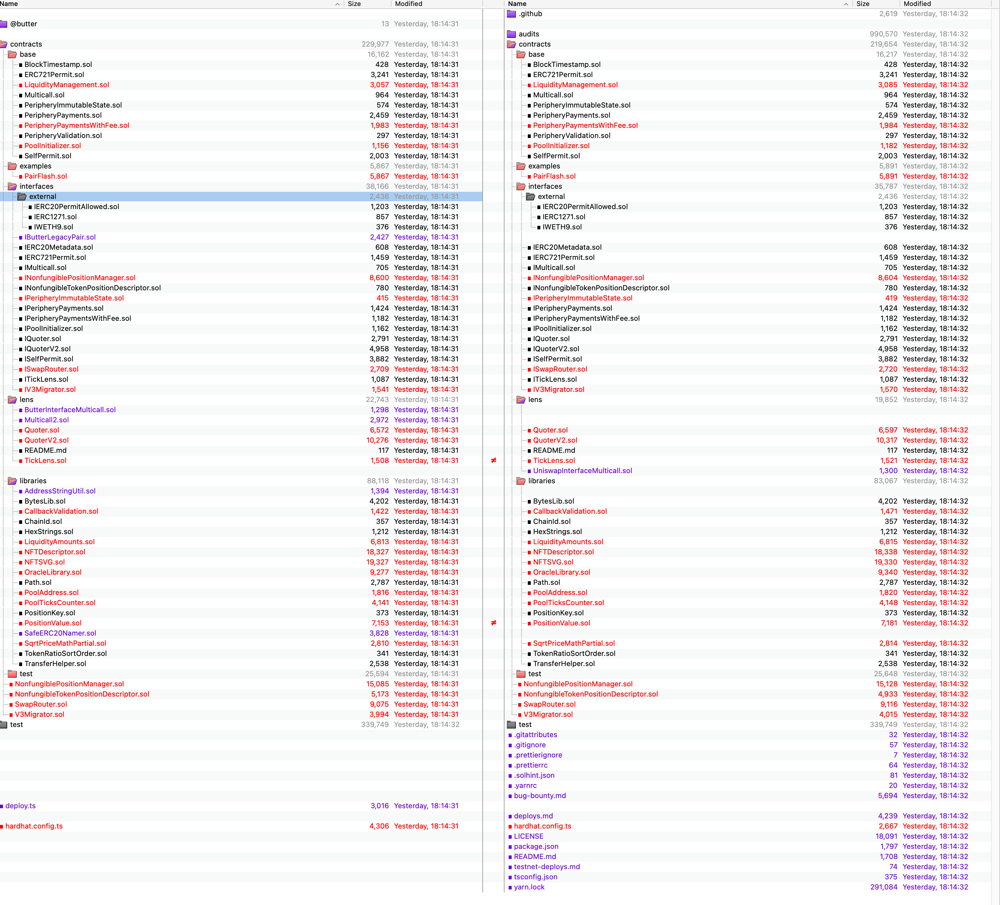

# Butter_UniSwap_Similarity_Analysis

## Purpose
The primary objective of this analysis is to assess the code similarity between the **[source repo](#source)** and the **[target repo](#target)**. 

Our engineering team has embarked on a detailed direct comparison of the code repositories. This examination aims to accurately quantify and understand the extent of similarity.

Our analysis result can be found in the **[conclusion](#conclusion)**.


## Code Repos

#### Source
* https://github.com/butterxyz/swap-contracts
    * commit hash: `aa59c690a77ed589562ee8f0ce8b6cbf6a193e9e`

#### Target
* https://github.com/uniswap/v3-core
    * `d8b1c635c275d2a9450bd6a78f3fa2484fef73eb`
* https://github.com/uniswap/v3-periphery
    * `6cce88e63e176af1ddb6cc56e029110289622317`
* https://github.com/uniswap/smart-order-router
    * `c696aada49b33c8e764e6f0bd0a0a56bd8aa455f`
* https://github.com/uniswap/universal-router
    * `471d99ba276c383d2353d065f7a682e710ca7bdc`


A copy of the codes has also been cloned into [source_code/](source_code/) and [target_code/](target_code/) for reference.


## Conclusion
Based on our comparison, we conclude that the **[source repo](#source)** and the **[target repo](#target)** are: **Nearly Identical**. 

The majority of changes are:
1. file renames
2. function renames
3. variable and comment renames

Most of the content is identical. With proper execution, the Butter protocol should perform in very similar ways to Uniswap V3.

Prior security assessments on target repos can be a good reference. Readers of this analysis, based on your security requirements, should determine on their own whether or not to directly trust the prior or existing security assessments or audits on target repos.


## Methodology for Similarity Comparison

In our approach, we primarily employed the fundamental algorithm underlying the `diff` utility to ascertain the degree of similarity at the string level between the source and target repos.

The `diff` utility, widely used in text comparison and analysis, operates on the principle of finding the longest common subsequence (LCS) between two sets of data, typically text files:
1. Longest Common Subsequence (LCS): The LCS is the heart of the diff algorithm. It finds the longest sequence of characters that appear in the same order in both files. Unlike substrings, the characters in a subsequence are not required to occupy consecutive positions. The LCS serves as a baseline for understanding the similarities between two files.
2. Differences Identification: After determining the LCS, diff analyzes the sections of the files that don't form part of this subsequence. These segments are the differences or changes. The algorithm efficiently pinpoints where the two files diverge from the LCS, marking these as either additions, deletions, or modifications.

The screenshots are from Beyond Compare for better visualization.

Tools used:
* `diff` - https://ss64.com/osx/diff.html
* DiffMerge: https://sourcegear.com/diffmerge/
* Beyond Compare: https://www.scootersoftware.com/


## Comparison Detail

#### Diff Compare -> v3-core
* Diff:
    * [source_code/swap-contracts/components/v3-core/](source_code/swap-contracts/components/v3-core/)
    * [target_code/v3_core/](target_code/v3-core/)
* Output: [results/v3-core](results/v3-core/)

```
$ diff -ur source_code/swap-contracts/components/v3-core/ target_code/v3-core/ > results/v3-core/diff1.txt
$ diff -u source_code/swap-contracts/components/v3-core/contracts/ButterFactory.sol target_code/v3-core/contracts/UniswapV3Factory.sol > results/v3-core/diff2.txt
$ diff -u source_code/swap-contracts/components/v3-core/contracts/ButterPool.sol target_code/v3-core/contracts/UniswapV3Pool.sol > results/v3-core/diff3.txt
$ diff -u source_code/swap-contracts/components/v3-core/contracts/ButterPoolDeployer.sol target_code/v3-core/contracts/UniswapV3PoolDeployer.sol > results/v3-core/diff4.txt
```

Main changes:
1. file renames
2. variable and function renames


Screenshot from Beyond Compare for Reference:


#### Diff Compare -> v3-periphery
* Diff:
    * [source_code/swap-contracts/components/v3-periphery/](source_code/swap-contracts/components/v3-periphery/)
    * [target_code/v3-periphery/](target_code/v3-periphery/)
* Output: [results/v3-periphery](results/v3-periphery/)

```
$ diff -ur source_code/swap-contracts/components/v3-periphery/ target_code/v3-periphery/ > results/v3-periphery/diff1.txt
$ diff -u source_code/swap-contracts/components/v3-periphery/contracts/lens/ButterInterfaceMulticall.sol target_code/v3-periphery/contracts/lens/UniswapInterfaceMulticall.sol > results/v3-periphery/diff2.txt
```

Main changes:
1. file renames
2. variable and function renames


Screenshot from Beyond Compare for Reference:



#### Diff Compare -> swap-router-contracts
* Diff:
    * [source_code/swap-contracts/components/swap-router-contracts/](source_code/swap-contracts/components/swap-router-contracts/)
    * [target_code/swap-router-contracts/](target_code/swap-router-contracts/)
* Output: [results/swap-router-contracts](results/swap-router-contracts/)
```
$ diff -ur source_code/swap-contracts/components/swap-router-contracts/ target_code/swap-router-contracts/ > results/swap-router-contracts/diff1.txt
$ diff -ur source_code/swap-contracts/components/swap-router-contracts/contracts/libraries/ButterLegacyLibrary.sol target_code/swap-router-contracts/contracts/libraries/UniswapV2Library.sol > results/swap-router-contracts/diff2.txt
```

Main changes:
1. file renames
2. variable and function renames

Screenshot from Beyond Compare for Reference:


#### Diff Compare -> universal-router
* Diff:
    * [source_code/swap-contracts/universal-router/](source_code/swap-contracts/universal-router/)
    * [target_code/universal-router/](target_code/universal-router/)

The `source_code/swap-contracts/universal-router/` is an external submodule, however, it seems it is not linked correctly.